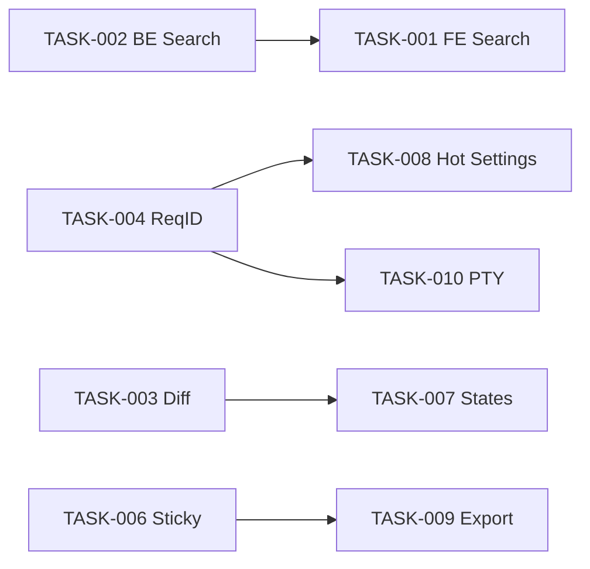

# TODO — DeepSeek Harness · Horizon 1 (Ship Now, 2 weeks)

> **Source:** `/storm -realty` 2026-08-29 · TASK-XXXX for Horizon 1 only (5 FE + 5 BE = 10 tasks) · P0/P1/P2 per storm scoring
> **Repo rule:** One task = 1 file batch ≤5 per `core-planning.md` §3, dispatch via caveman agents

| ID | Priority | Feature | Owner | Effort | Depends | Done when |
|----|----------|---------|-------|--------|---------|-----------|
| TASK-001 | P0 | FE-001 Search FE (UI: input + pills + highlight) | `packages/client/ui-session` | 2 d | BE-001 | `GET /api/sessions/search?q=compaction` in story shows 3 results with `<mark>` in <200 ms |
| TASK-002 | P0 | BE-001 Search BE (`GET /api/sessions/search`) | `packages/session-query/session-query-sqlite` | 2 d | — | `EXPLAIN ANALYZE` shows Index Only Scan, `vitest` 100% lines, snapshot updated |
| TASK-003 | P0 | FE-002 Diff Viewer (streaming side-by-side) | `packages/client/ui-primitives` | 4 d | — | Live write 100L streams line-by-line, dark passes axe, copy works |
| TASK-004 | P0 | BE-002 Request-ID middleware + structured log | `packages/api/gateway` | 1 d | — | `curl -H x-request-id:foo` → response has same header, JSON log has `request_id/route/status/latency_ms`, no PII |
| TASK-005 | P0 | BE-003 Per-host web_fetch TokenBucket | `packages/web/web-fetch-http` | 1 d | — | 20 fetches same host → 10 pass + 10×429 with `Retry-After`, cross-host unaffected |
| TASK-006 | P0 | FE-003 Sticky input + jump-to-latest + token meter | `packages/client/ui-conversation` | 1 d | — | 120-turn fixture scroll test passes, budget bar turns yellow at 75% |
| TASK-007 | P1 | FE-004 States audit (all slots) | `packages/client/ui-renderer` | 3 d | — | Every slot has 7 branches, `verify-client-domain-graph` green, reduced-motion respected |
| TASK-008 | P1 | FE-005 Hot settings (no restart) | `packages/client/ui-settings-models` + `packages/settings/settings` | 3 d | TASK-004 | Change model mid-session → next prompt uses new model, toast "Revert" works |
| TASK-009 | P1 | BE-004 `dsh session export/import` CLI + exact Fetch | `packages/session/session-persistence` | 3 d | — | Export 50-turn zip → import on fresh home → snapshot byte-identical, 300 MiB streams |
| TASK-010 | P1 | BE-005 PTY survive reconnect (64 kB buffer) | `packages/terminal/terminal-bash` | 5 d | — | `sleep 10` → reload → output intact, `send` readiness 409 when not ready |

## Dependency Graph (TASK)



## Effort Rollup

- **Total Horizon 1:** 25 d (with 3 devs parallel → ~9 calendar days, one file = one agent wave)
- **Critical path:** `TASK-002 → TASK-001` (4 d) + `TASK-010` (5 d) — run in parallel
- **Quick wins first:** `TASK-004` (1 d) + `TASK-005` (1 d) + `TASK-006` (1 d) = ship day 2 demo

## How to dispatch (caveman prompt shape)

```
TASK: Implement per-host TokenBucket for web_fetch
FILES: packages/web/web-fetch-http/src/policy.ts, packages/web/web-fetch-http/src/index.ts
CONSTRAINTS: - Config-driven webFetchHostRps, no hardcoded tunables
            - TokenBucket 10/2s, 429 with Retry-After
            - Existing pinned-lookup SSRF unchanged
DONE WHEN: pnpm exec vitest run packages/web/web-fetch-http/tests/fetch-http.spec.ts passes
STYLE: Caveman. Short words. No explain. Do.
```

## After Horizon 1 — Next (not in this TODO.md, see `frontend-features.md`/`backend-features.md`)

- Horizon 2: `FE-006` palette, `FE-007` mobile, `BE-006` hot skills, `BE-007` idempotency, `BE-009` subagent cancel
- Horizon 3: `FE-010` dark audit, `FE-011` inbox, `BE-010` /metrics histogram, `BE-011` E2B fallback

## Verification

- `pnpm run test:coverage` — per-file 100% on changed `packages/**`
- `pnpm run duplication` — 0 clones
- `pnpm run verify-file-cap` — 0 new over 250L
- `pnpm run verify-observability` — RED alerts wired
- Snapshots: `pnpm run test:snapshot` (keyless) green, `pnpm run test:web` (replay) green
