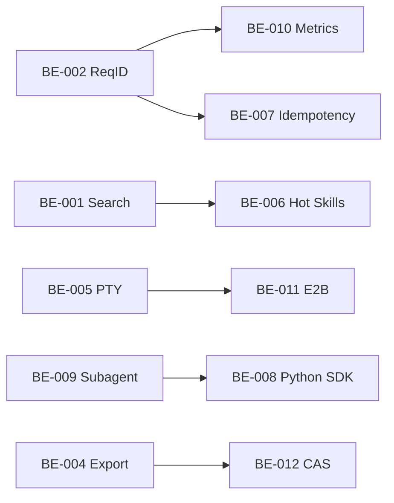

# Backend Features — DeepSeek Harness

> **Source:** `/storm -realty` 2026-08-29 · 12 BE features devs actually want (not infra fantasy)
> **Stack:** Node 24 · TypeScript strict · Cordis services · SQLite (session) · pnpm 11 · Dokploy-ready

---

## Horizon 1 — Now (2 weeks) · Ship immediately · 5 features

### BE-001 — Session Search That Actually Works (BE side)
- **Status:** planned
- **Priority:** P0
- **Domain:** `session-query` + `session` persistence
- **Problem:** FTS exists in `session-query-sqlite/src/index.ts:653` but no HTTP surface — FE can't query. Devs `grep` the filesystem.
- **Solution:** Expose `GET /api/sessions/search` (see API-001) with `q, status, preset, from, to, limit, cursor` — keyset pagination `(match_count DESC, session_id ASC, seq DESC)` already proven in `packages/core/session/src/index.ts:472`. Add composite index `(created_at DESC, id DESC)` for non-FTS fallback. Rate limit 30r/s general.
- **Endpoints:** `API-001`
- **DB Tables:** uses `persisted_docs` FTS5 `WITH filtered/matched/ranked` CTE (no new table); add `idx_sessions_created_id` if missing
- **Failure Modes:** FTS `OFFSET` cost linear → cursor required for deep pages; empty `q` → fallback to `session/list` cursor; `limit>100` → 400
- **Mocks:** `MOCK-001` 50 sessions
- **Effort:** S (2 d) · **Impact:** 5 · **Score:** 8.5
- **Acceptance:** `p95 200 ms` at 50 sessions, `EXPLAIN ANALYZE` shows `Index Only Scan`, `pnpm test:coverage` 100% on new lines

### BE-002 — Request-ID + Structured Logging (observability.md §3)
- **Status:** planned
- **Priority:** P0
- **Domain:** `api/gateway` + `client/connection`
- **Problem:** We just scaffolded `request-id.ts` but no middleware wires it. Logs have no `request_id`, so `p95>2s` alert is unactionable (observability.md says "no alert without runbook link + request_id").
- **Solution:** Gateway Host plugin: on every `/api` and WS upgrade, `resolveRequestId(inboundHeader)` → `ctx.effect` → `x-request-id` response header + `ctx.logger` child with `request_id` + `route/status/latency_ms` per `requestLogFields`. Never log tokens/raw PII (hash `user_id`).
- **Endpoints:** all (`API-005` `/metrics` also needs it)
- **DB Tables:** none
- **Failure Modes:** missing header → mints `req_*`; invalid chars → mints; downstream timeout → log with `err.type=timeout`
- **Mocks:** `MOCK-012` log fixtures
- **Effort:** S (1 d) · **Impact:** 5 · **Score:** 9.5
- **Acceptance:** `curl -H x-request-id:foo /api/sessions/list` → response header `x-request-id: foo`; structured JSON log line has `request_id`, `route`, `status`, `latency_ms`

### BE-003 — Per-Host Rate Limit + SSRF Hardening (Already SSRF-safe, now rate-safe)
- **Status:** planned
- **Priority:** P0
- **Domain:** `web/web-fetch-http` + `api/gateway`
- **Problem:** `network.ts:74` SSRF is exemplar (pinned lookup, NAT64 aware), but `web_fetch` can be spammed by a looping agent — no per-host budget.
- **Solution:** `web-fetch-http` provider adds `TokenBucket { capacity: 10, refill: 2/s }` per hostname, keyed by `publicHttpNetwork.resolve` result (so `example.com`→`93.184…` maps one bucket). 429 with `Retry-After`. Expose config `webFetchHostRps` via `Config` (no hardcoded tunables).
- **Endpoints:** `API-006` `POST /api/tools/web_fetch` (internal)
- **Failure Modes:** bucket full → `WEB_RATE_LIMITED` (429); DNS pin mismatch → `WEB_BLOCKED_URL`; Redirect cross-origin → refused (`policy.ts:isSameOrigin`)
- **Mocks:** `MOCK-013` rate-limit fixtures
- **Effort:** S (1 d) · **Impact:** 4 · **Score:** 8.0
- **Acceptance:** 20 fetches to same host in 1 s → 10 succeed, 10th+ 429 with `Retry-After: 2`, different host unaffected, `fetch.spec.ts` proves `isSameOrigin` + pinned lookup still

### BE-004 — `dsh session export/import` with Encryption & PITR-lite
- **Status:** planned
- **Priority:** P1
- **Domain:** `session/session-persistence` + `session/session-persistence-jsonl`
- **Problem:** Session on disk is opaque JSONL + SQLite — dev can't share a repro or back up before destructive migration. No `export`.
- **Solution:** Add `dsh session export <id> --out foo.zip` (zstd JSONL + header + attachments manifest) and `dsh session import foo.zip`. Encrypt with `age` if `--encrypt` (key from `credentials`). Exact Fetch route `GET /api/sessions/:id/export` streams zip (respecting `maxRequestBodyBytes` taxonomy).
- **Endpoints:** `API-002` `GET /api/sessions/:id/export` + `API-007` `POST /api/sessions/import`
- **DB Tables:** none (file); verify `SESSION_FORMAT_VERSION` bump if wire changes
- **Failure Modes:** missing session → 404; `SCHEMA_VERSION` mismatch → 409 with migration hint; corrupt zip → 422; large session (300 MiB) → streaming, not buffered
- **Mocks:** `MOCK-014` export fixtures (small + large + encrypted)
- **Effort:** M (3 d) · **Impact:** 4 · **Score:** 7.0
- **Acceptance:** Export 50-turn session → zip <5 MiB → import on fresh `$DSH_HOME` → `session/query` returns same `SessionEventLikeEntry` window, snapshots replay byte-identical

### BE-005 — PTY Resilience: Persistent Terminal That Survives Reconnect
- **Status:** planned
- **Priority:** P1
- **Domain:** `terminal/terminal-bash` + `subprocess`
- **Problem:** `TerminalSanitizer` is good, but `send` readiness races and long `sleep 100` kills still flake (XXX markers `pty-*`). Dev's `npm run dev` dies when browser reloads.
- **Solution:** Make `terminal-bash` session survive `Connection` generation loss: keep PTY in Host, buffer last 64 kB (`maxReadBytes`), on reconnect replay from `promptTail` marker. Add `withConnection` leak guard (backend-perf.md §4.2) and `statement_timeout`-style `sendTimeout`.
- **Endpoints:** `API-008` `WS /api/terminal/:id` (existing, harden)
- **DB Tables:** none (in-memory ring buffer)
- **Failure Modes:** buffer overflow → drop oldest, log `WARN truncated`; PTY dead → `session/persistence` emits `terminal/died` event; send while not ready → 409 `PTY_NOT_READY`
- **Mocks:** `MOCK-015` PTY session fixtures (long run, reconnect)
- **Effort:** M (5 d) · **Impact:** 4 · **Score:** 6.5
- **Acceptance:** Start `sleep 10` in terminal → reload browser → output intact, `send("echo hi")` still works, `sanitize.spec.ts` still 100%

---

## Horizon 2 — Next Month · Differentiators · 4 features

### BE-006 — Skill Filesystem Hot-Reload (No Restart)
- **Status:** planned
- **Priority:** P0
- **Domain:** `skill/skill-filesystem` + `boot/app-boot`
- **Problem:** Adding a `SKILL.md` requires `dsh` restart to re-index — kills inner loop. Devs want "edit skill, press save, use".
- **Solution:** `skill-filesystem` watches `**/SKILL.md` via `Chokidar` (already in `packages/fs` patterns), on change re-runs `catalog/loader` tool, emits `skill/change` event, `skill/src/index.ts` hot-commits via `ctx.effect` disposal + re-register (HMR-safety test required). Keep `ctx.get` optional-service pattern.
- **Endpoints:** none (Cordis event)
- **Failure Modes:** parse error in SKILL.md → keep old catalog, log `WARN` with `skillId`, do not crash loop
- **Mocks:** `MOCK-016` skill FS fixtures (add/edit/delete)
- **Effort:** M (3 d) · **Impact:** 5 · **Score:** 8.0
- **Acceptance:** Edit `SKILL.md` → `skill/list` returns new tool within 500 ms, no restart, HMR disposer test passes

### BE-007 — Idempotency Keys + Rate Limits for All POST/PUT
- **Status:** planned
- **Priority:** P1
- **Domain:** `api/gateway` + `core/tools`
- **Problem:** Browser retry (network blip) double-submits `POST /api/sessions/:id/prompt` → duplicate tool calls billed twice.
- **Solution:** Gateway middleware: `Idempotency-Key: <uuid>` header required on `prompt`, `cancel`, `create`. Redis-less: in-memory LRU 10k keys, 24 h TTL, keyed by `(user_id, key)`. Return cached response on replay (RFC 7231). Rate limit: `auth 1r/s burst 5`, `api 10r/s burst 20` (nginx §3.4 numbers, but enforced in Node too for headless profile).
- **Endpoints:** `API-009` `POST /api/sessions/:id/prompt` (add header), `API-010` `POST /api/sessions/:id/cancel`
- **Failure Modes:** duplicate key with different payload → 422 `IDEMPOTENCY_KEY_REUSE`; stale key >24 h → treat as new
- **Mocks:** `MOCK-017` idempotency fixtures
- **Effort:** M (3 d) · **Impact:** 4 · **Score:** 7.5
- **Acceptance:** Send `prompt` with same key twice → second returns same `callId` without double LLM call, `brake` test proves `auth` 1r/s throttling

### BE-008 — Python SDK Parity (Session Streaming + Tool Parity)
- **Status:** planned
- **Priority:** P1
- **Domain:** `python/` + `sdk/`
- **Problem:** TS SDK streams full `SessionEventLikeEntry`, Python SDK lags — subagent consumers can't port.
- **Solution:** Port `session-query` bounded reads + `tool-subagent` delegation Consumers to Python, share `SESSION_FORMAT_VERSION` handling (fail-closed). Keep `python/README.md` model experience parity table.
- **Endpoints:** same as TS (`API-001` etc) via `sdk` JSON-RPC
- **Failure Modes:** `SESSION_FORMAT_VERSION` mismatch → fail-closed with "update SDK" message, not silent
- **Mocks:** `MOCK-018` Python snapshot fixtures
- **Effort:** L (7 d) · **Impact:** 4 · **Score:** 6.0
- **Acceptance:** `pytest -k llm` + `vitest snapshot` both green, `sdk` expected outputs byte-identical between TS/Python

### BE-009 — Subagent Fork with Proper Cancellation & Timeout Propagation
- **Status:** planned
- **Priority:** P1
- **Domain:** `subagent/tool-subagent` + `core/agent-loop`
- **Problem:** Forked subagent outlives parent, `abort` doesn't propagate, `concurrent-subagents` XXX at `llm-replay/index.ts:642` — ordinal race.
- **Solution:** Parent `AgentHandle` owns child `AbortSignal` (initiator scope `AGENTS.md`). On parent cancel, `subagent/finished` with `canceled` + `token-meter` flush. Fix `XXX(concurrent-subagents)` by explicit first-call ordinal in `llm-replay`.
- **Endpoints:** none (internal)
- **Failure Modes:** child timeout → parent gets `subagent/timeout` event; parent already dead → child auto-canceled within one tick
- **Mocks:** `MOCK-019` subagent fixtures (parallel, cancel, timeout)
- **Effort:** M (4 d) · **Impact:** 4 · **Score:** 6.8
- **Acceptance:** Start 2 concurrent subagents → cancel parent → both children `canceled` within 100 ms, no orphan `llm` calls

---

## Horizon 3 — Quarter · Foundation & Scale · 2 features

### BE-010 — Observability: Real Prometheus Metrics + SLO Burn-Down (Finish H1 Scaffold)
- **Status:** planned
- **Priority:** P2
- **Domain:** `api/gateway` + `observability/`
- **Problem:** We scaffolded `compose.observability.yml` but `/metrics` histogram still stub. No `p95<500ms` alert fires.
- **Solution:** Implement `prom-client` histogram `http_request_duration_seconds{route}` + counter `http_requests_total{route,status}` in gateway. Wire to `request-id.ts` latency. Grafana dashboard `dsh-red.json` already provisioned. Add `verify-observability` to CI `hygiene`.
- **Endpoints:** `API-005` `GET /metrics` (prom)
- **Failure Modes:** metrics scrape fails → `up==0` alert; high cardinality `route` → whitelist 20 routes, rest `__other__`
- **Mocks:** none (real histogram)
- **Effort:** M (5 d) · **Impact:** 4 · **Score:** 6.2
- **Acceptance:** `curl /metrics` shows `http_request_duration_seconds_bucket`, `promtool check rules observability/alerts.yml` passes, `grafana` panel shows p95

### BE-011 — E2B Sandbox Quota + Fallback to Local (Ship the POC)
- **Status:** planned
- **Priority:** P2
- **Domain:** `e2b/` + `sandbox/sandbox-local`
- **Problem:** `e2b` POC exists (`packages/e2b/e2b`) but no quota, no fallback — when E2B down, agent has zero sandbox.
- **Solution:** E2B provider adds `quota { maxConcurrent: 5, maxCpuMs: 120s }` + fallback chain: try E2B → on `E2B_QUOTA` or `network` → fallback to `sandbox/local` and emit `WARN sandbox.fallback`. Record fallback in `tool` result metadata for Web card.
- **Endpoints:** none (provider internal)
- **Failure Modes:** quota exceeded → 429 + `Retry-After`; E2B timeout → fallback; both fail → `SANDBOX_UNAVAILABLE` with runbook link
- **Mocks:** `MOCK-020` E2B fallback fixtures
- **Effort:** L (6 d) · **Impact:** 3 · **Score:** 5.5
- **Acceptance:** Kill E2B mock → 5 parallel `bash` calls still succeed via local, `tool` card shows "ran locally (E2B unavailable)"

---

## Horizon 4 — Moonshot (6+ mo) · 1 feature

### BE-012 — Content-Addressed Skill Cache + Offline Bundle (The "Real Dev Wants" Moonshot)
- **Status:** planned
- **Priority:** P3
- **Domain:** `skill/` + `bundle/` + `storage/`
- **Problem:** Devs on plane have no skills (needs network to `skill` registry). Every session re-downloads same Python tool deps.
- **Solution:** CAS for `skill` bundles and `code-runtime` deps keyed by `sha256(manifest)`, stored under `$DSH_HOME/cache/cas/`, packed into `dsh --bundle` offline artifact. On `dsh --profile offline` boot, resolver serves from CAS without network. GC by `mtime + 30d`.
- **Endpoints:** `API-011` `GET /api/skills/cas/:sha`
- **Failure Modes:** cache miss offline → 412 `OFFLINE_MISSING_SKILL` with "run once online to cache"
- **Mocks:** `MOCK-021` CAS fixtures
- **Effort:** XL (12 d) · **Impact:** 4 · **Score:** 4.5
- **Acceptance:** `dsh --bundle` on plane → skill list identical to online, `pnpm run build` uses cached deps, no network calls in `strace`

---

## Scoring (Impact×2 + Uniqueness×1.5 − Effort − Risk×0.5)

| ID | Impact | Effort 5=easy | Risk 5=safe | Uniq | Score |
|----|--------|---------------|-------------|------|-------|
| BE-001 | 5 | 4 | 5 | 2 | 8.5 |
| BE-002 | 5 | 5 | 5 | 1 | 9.5 |
| BE-003 | 4 | 5 | 4 | 2 | 8.0 |
| BE-004 | 4 | 3 | 4 | 2 | 7.0 |
| BE-005 | 4 | 2 | 3 | 2 | 6.5 |
| BE-006 | 5 | 3 | 4 | 3 | 8.0 |
| BE-007 | 4 | 3 | 4 | 1 | 7.5 |
| BE-008 | 4 | 2 | 3 | 2 | 6.0 |
| BE-009 | 4 | 3 | 3 | 2 | 6.8 |
| BE-010 | 4 | 3 | 4 | 1 | 6.2 |
| BE-011 | 3 | 2 | 3 | 2 | 5.5 |
| BE-012 | 4 | 1 | 2 | 4 | 4.5 |

## Dependency Graph (BE)

## Failure Modes Summary (P0/P1 only)

| Feature | Primary failure | Response |
|---------|-----------------|----------|
| BE-001 | FTS5 syntax error | 400 `INVALID_QUERY` |
| BE-002 | Invalid request_id chars | mint new |
| BE-003 | Host 429 | 429 + Retry-After |
| BE-004 | SCHEMA_VERSION mismatch | 409 |
| BE-005 | PTY buffer overflow | WARN + truncate oldest |
| BE-006 | SKILL.md parse error | keep old catalog |
| BE-007 | Idempotency reuse with diff payload | 422 |
| BE-009 | Child timeout | `subagent/timeout` event |
