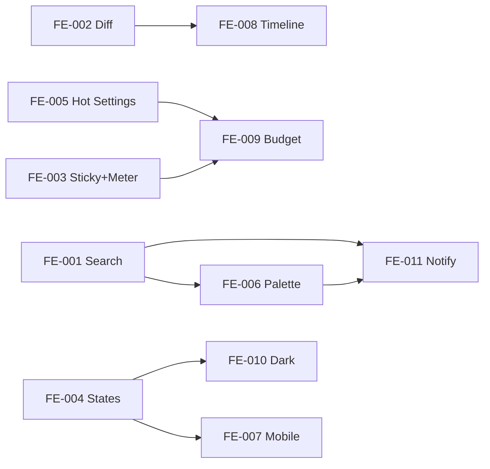

# Frontend Features — DeepSeek Harness Web Client

> **Source:** `/storm -realty` 2026-08-29 · 12 FE features triaged at realty level (what devs actually want, not demo glitter)
> **Stack:** Cordis Slots, `client/connection`, `api/session-controller` Client model, `ui-chat`/`ui-trajectory`, Vite + React 18, `dsh-web-app` profile

---

## Horizon 1 — Now (2 weeks) · Ship immediately · 5 features · Quick wins

### FE-001 — Session Search That Actually Works
- **Status:** planned
- **Priority:** P0
- **Page/Route:** `/` session list + `cmd+k` command palette
- **Problem:** Devs have 200+ sessions, list is chronological only, `session-query` FTS exists but UI only filters by title. Finding "that migration that broke" costs 3 min of scrolling.
- **Solution:** Wire existing `tool-session-query` FTS (`GET /api/sessions/search?q=&status=&preset=&date=`) to the list: debounced input (150 ms), pill filters (active/archived, preset, 7/30 days), result snippet with `<mark>` on `marked_text`, keyboard nav (↑/↓ + enter).
- **States:** loading (skeleton 3 rows) · empty (illustration + "No sessions match 'migration'" + Clear CTA) · error (retry) · offline (queue query) · rate-limited (n/a)
- **Animations:** enter fade+slide (100 ms), highlight pulse on match, pill add/remove spring
- **Responsive:** mobile — search collapses to icon → full-width sheet; filters become bottom sheet
- **Dark:** highlight bg adjusts (`--dsw-search-highlight` token)
- **A11y:** `role="search"`, `aria-live` for result count, focus trap in palette, `prefers-reduced-motion`
- **Effort:** S (2 d) · **Impact:** 5 · **Score:** 8.0
- **Mocks:** `MOCK-001` session list with 50 mixed fixtures
- **APIs:** `API-001` `GET /api/sessions/search`
- **Depends:** `BE-001`
- **Acceptance:** 50-session fixture, type "compaction" → results <200 ms, snippet highlighted, URL `?q=` shareable

### FE-002 — Streaming Diff Viewer (Live Code Review)
- **Status:** planned
- **Priority:** P0
- **Page/Route:** `session/:id` trajectory + chat file cards
- **Problem:** Agent writes 300-line migration, dev sees raw `write` tool card with truncated text — must open file to review. Cursor & Claude Code both show inline diff. We lose on DX.
- **Solution:** Render `fs/write` & `fs/edit` results as Monaco-style side-by-side diff (shiki already in vendor). Stream tokens into diff while agent writes; collapsed by default, "Expand diff" shows +/- with copy & "Apply/Revert" callbacks via `ctx.fs`.
- **States:** streaming (shimmer on new lines) · empty (no changes) · error (binary file → "Preview unavailable")
- **Effort:** M (4 d) · **Impact:** 5 · **Score:** 7.5
- **Mocks:** `MOCK-002` 3 diff fixtures (add, edit, rename)
- **APIs:** `API-002` `GET /api/sessions/:id/file?path=`
- **Depends:** `BE-006` (file read via exact Fetch route)
- **Acceptance:** Live write of 100 lines appears line-by-line without layout shift, dark mode passes contrast, keyboard copy works

### FE-003 — Conversation UX: Sticky Input + Jump-to-Latest + Token Meter
- **Status:** planned
- **Priority:** P0
- **Page/Route:** `session/:id` chat
- **Problem:** Long sessions (100+ turns) lose input box on scroll, no token/cost visibility, "where am I" disorientation.
- **Solution:** Sticky input bar with `scroll-anchor` (spec `overflow-anchor`), "↓ 12 new" pill when scrolled up, per-turn footer showing `tokens, cost, ttft, tps` (from `turn-metrics.ts`), sticky budget bar ` 80% context used — compaction suggested`.
- **Effort:** S (1 d) · **Impact:** 4 · **Score:** 9.0
- **Mocks:** `MOCK-003` 120-turn conversation with metrics
- **APIs:** none (client-side derived from `SessionEventLikeEntry`)
- **Acceptance:** Scroll 50 turns up → pill appears → click scrolls to bottom in 200 ms spring, metrics match `turn-metrics.spec.ts` snapshot

### FE-004 — Empty / Error / Offline / Disabled States Everywhere
- **Status:** planned
- **Priority:** P1
- **Page/Route:** All slots (`tool.call.toolview`, `session.list`, `workspace.browser`)
- **Problem:** New users see blank chat, no onboarding. Offline `dsh web` shows spinner forever (no Offline slot).
- **Solution:** Audit every `SlotMap` entry, add missing state branches: onboarding hero for empty session (3 starter prompts), offline queue banner ("3 actions queued — syncing when online"), disabled tooltip ("Why is Prompt disabled? Agent is thinking…"), rate-limited cooldown timer.
- **Effort:** M (3 d) · **Impact:** 4 · **Score:** 7.0
- **Mocks:** `MOCK-004` 7 state fixtures
- **APIs:** none
- **Acceptance:** `pnpm run verify-client-domain-graph` passes, Storybook for each state, `prefers-reduced-motion` disables enter animation

### FE-005 — Settings UI Without Restart (Model/Preset Hot-Swap)
- **Status:** planned
- **Priority:** P1
- **Page/Route:** `settings` panel + session header gear
- **Problem:** Changing model requires editing `cordis.yml` and `dsh` restart — kills flow. Devs want per-session "try deepseek-chat vs deepseek-reasoner".
- **Solution:** `ui-settings-models` already exists — wire `ClientSessions` `updateSettings` to `settings/settings` hot-commit (`ns: "session"`), show pill "Reasoner · $0.12" in header, persist to `session` scope not global.
- **Effort:** M (3 d) · **Impact:** 4 · **Score:** 7.2
- **Mocks:** `MOCK-005` settings store with 2 models
- **APIs:** `API-003` `PATCH /api/sessions/:id/settings`
- **Acceptance:** Change model mid-session → next prompt uses new model (verified via `session-telemetry` record), no reload, undo via "Revert" in 5 s toast

---

## Horizon 2 — Next Month · Differentiators · 4 features

### FE-006 — Command Palette (cmd+k) — The Real "What Devs Want"
- **Status:** planned
- **Priority:** P0
- **Page/Route:** Global `overlay` slot
- **Problem:** Devs live in keyboard. Clicking sidebar → session → prompt is 3 clicks. No quick open, no fuzzy find.
- **Solution:** `cmd+k` palette with modes: `> ` commands, `@` sessions, `#` workspaces, `?` help. Fuzzy via `client/ui-primitives` + `useMemo` filtered list (no new dep). Shows recent 5 + search. Calls `ctx.sessions`/`ctx.workspaces` directly.
- **States:** loading (shimmer) · empty (type to search) · error (n/a)
- **Effort:** M (3 d) · **Impact:** 5 · **Score:** 8.5
- **Mocks:** `MOCK-006` palette items fixture
- **APIs:** `API-001` reused
- **Depends:** `FE-001` search ranking
- **Acceptance:** `cmd+k` → type "mig" → "MIG-042" appears <100 ms, arrow nav + enter opens session without full page reload

### FE-007 — Mobile-Responsive Shell (Bottom Nav, Swipe, Gestures)
- **Status:** planned
- **Priority:** P1
- **Page/Route:** Shell `root` + `ui-layout`
- **Problem:** `apps/web` on phone is desktop shrunk — sidebar off-screen, no thumb reach.
- **Solution:** `<768px`: sidebar → bottom nav (Sessions, Workspaces, Settings), trajectory collapses to single column with swipe between Chat/Trajectory, touch 44 px targets, `cmd+k` → `tap search`. Container queries not static breakpoints.
- **Effort:** L (7 d) · **Impact:** 4 · **Score:** 5.5
- **Mocks:** `MOCK-007` responsive snapshots (320, 768, 1024)
- **APIs:** none
- **Acceptance:** Playwright `complex-history.perf.ts` passes at 375 px, no horizontal scroll, focus visible

### FE-008 — Trajectory Timeline + Keyboard Nav
- **Status:** planned
- **Priority:** P1
- **Page/Route:** `trajectory` target
- **Problem:** `TrajectoryTable.tsx` 3200L but flat list — no way to jump between tool clusters, no `j/k` nav.
- **Solution:** Sticky timeline gutter (group by turn/step), minimap click → scroll, `j/k` next/prev tool, `o` collapse, `y` copy tool input, `t` toggle chat/trajectory. Keep existing layout but extract `useTrajectoryNav` hook.
- **Effort:** M (4 d) · **Impact:** 4 · **Score:** 6.5
- **Mocks:** `MOCK-008` trajectory with 40 tool calls
- **APIs:** none
- **Acceptance:** `j` 40 times never skips, screen reader announces "Tool 12 of 40: bash", `verify-file-cap` split reduces file <250L

### FE-009 — Cost Guardrails & Budget Nudges
- **Status:** planned
- **Priority:** P2
- **Page/Route:** Session header + settings
- **Problem:** No visibility into spend until bill. Devs blow $20 on a looping agent.
- **Solution:** Header budget bar (green <50%, yellow 50–80%, red >80%), toast "Context 75% — compaction will run next turn", per-session spend `token-meter` projection, hard cap setting `maxUsdPerSession` that pauses queue and asks approval.
- **Effort:** S (2 d) · **Impact:** 3 · **Score:** 6.0
- **Mocks:** `MOCK-009` token-meter fixtures (high usage)
- **APIs:** `API-004` `GET /api/sessions/:id/usage`
- **Acceptance:** At 80% → yellow + `prefers-reduced-motion` disables pulse, cap triggered → approval prompt blocks next `prompt()`

---

## Horizon 3 — Quarter · Scale & Polish · 2 features

### FE-010 — Dark Mode + High-Contrast + Reduced Motion Audit (Realty Polish)
- **Status:** planned
- **Priority:** P2
- **Page/Route:** `ui-theme` + all primitives
- **Problem:** Dark mode exists but `CodeBlock` shiki theme not retuned, `TrajectoryTable` shadows wrong in dark, no high-contrast.
- **Solution:** Token pass: every `--dsw-*` has dark/light/high-contrast triad, `verify-client-ui-i18n` already, add `verify-theme-tokens` that fails if raw color literal found. Respect `prefers-contrast` and `prefers-reduced-motion` globally.
- **Effort:** M (5 d) · **Impact:** 3 · **Score:** 5.0
- **Mocks:** none
- **APIs:** none
- **Acceptance:** Lighthouse a11y 100, axe 0 violations, chromatic snapshot passes for 3 themes

### FE-011 — Notifications & Approvals Center (Single Inbox)
- **Status:** planned
- **Priority:** P2
- **Page/Route:** `overlay` bell + `approval` slot
- **Problem:** Approvals (`tool: bash rm -rf`) show as inline cards deep in chat — missed if scrolled. Subagent finishes silent.
- **Solution:** Bell icon with count (derived from `ctx.approval` queue + `subagent/finished` events), slide-over inbox that aggregates `approval/request`, `ask-user`, `subagent/finished`, each row → jump to location + approve/deny without losing scroll.
- **Effort:** L (6 d) · **Impact:** 4 · **Score:** 5.8
- **Mocks:** `MOCK-010` mixed notification fixtures
- **APIs:** none (observes `SessionEventMap` + approval seam)
- **Acceptance:** Trigger 3 approvals while scrolled up → bell 3 → click → scrolls to exact tool call, `useSession` does not re-render unrelated rows

---

## Horizon 4 — Moonshot (6+ mo) · 1 feature

### FE-012 — Shared Canvas — Human & Agent Co-Edit File in Real Time
- **Status:** planned
- **Priority:** P3
- **Page/Route:** `session/:id` new `canvas` target
- **Problem:** Agent edits file, human opens VS Code — conflict, no merge. Realty moonshot devs actually whisper: "I wish I could nudge the file while agent thinks."
- **Solution:** CRDT-lite shared buffer for the active file: agent's `fs/edit` streams as remote patches, human's keystrokes as local patches, Host merges by `seq` (last writer wins with gutter conflict marker), preview pane shows agent vs human cursors. Built on existing `fs` seam, no new DB.
- **Effort:** XL (14 d) · **Impact:** 5 · **Score:** 4.0
- **Mocks:** `MOCK-011` concurrent edits fixture
- **APIs:** `API-005` `WS /api/sessions/:id/canvas`
- **Acceptance:** Human types while agent writes → no data loss, conflict marker appears, `session/flush` still linearizable

---

## Appendix — Scoring (Impact×2 + Uniqueness×1.5 − Effort − Risk×0.5)

| ID | Impact | Effort (5=easy) | Risk (5=safe) | Uniqueness | Score |
|----|--------|-----------------|---------------|------------|-------|
| FE-001 | 5 | 4 | 5 | 2 | 8.0 |
| FE-002 | 5 | 3 | 3 | 2 | 7.5 |
| FE-003 | 4 | 5 | 5 | 2 | 9.0 |
| FE-004 | 4 | 3 | 5 | 1 | 7.0 |
| FE-005 | 4 | 3 | 4 | 2 | 7.2 |
| FE-006 | 5 | 3 | 4 | 3 | 8.5 |
| FE-007 | 4 | 2 | 3 | 1 | 5.5 |
| FE-008 | 4 | 3 | 4 | 2 | 6.5 |
| FE-009 | 3 | 4 | 5 | 2 | 6.0 |
| FE-010 | 3 | 3 | 4 | 1 | 5.0 |
| FE-011 | 4 | 2 | 3 | 2 | 5.8 |
| FE-012 | 5 | 1 | 2 | 5 | 4.0 |

## Dependency Graph (FE)

